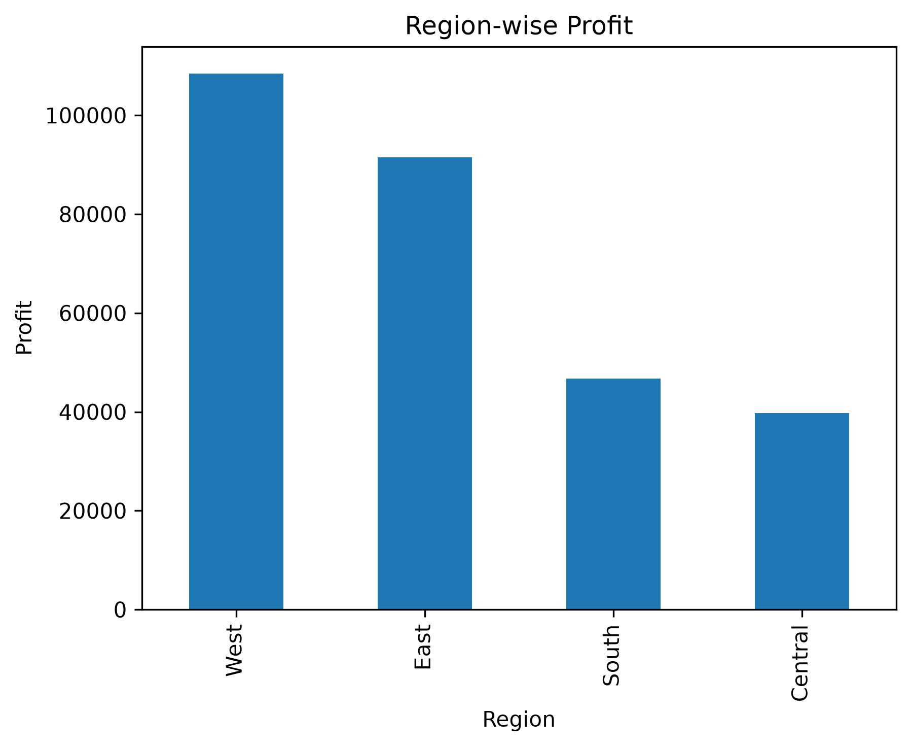
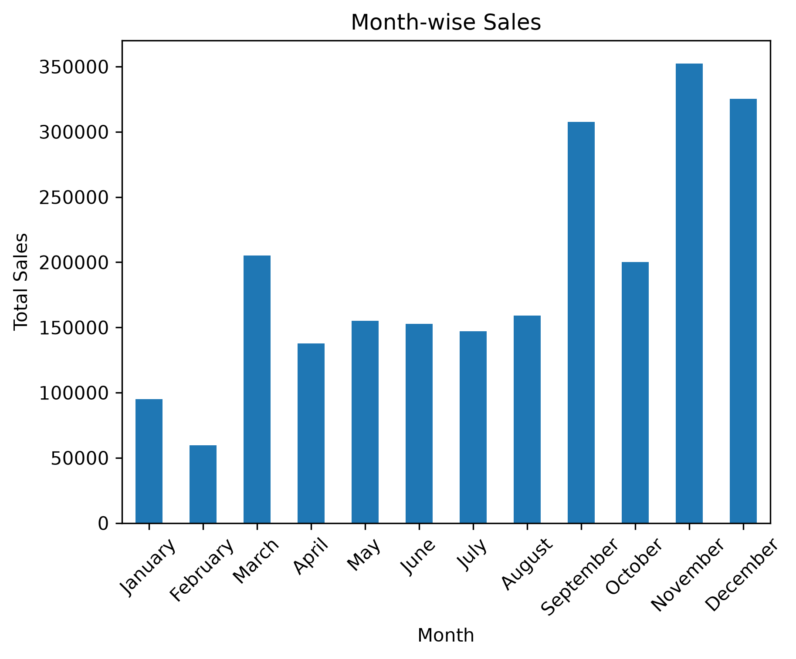
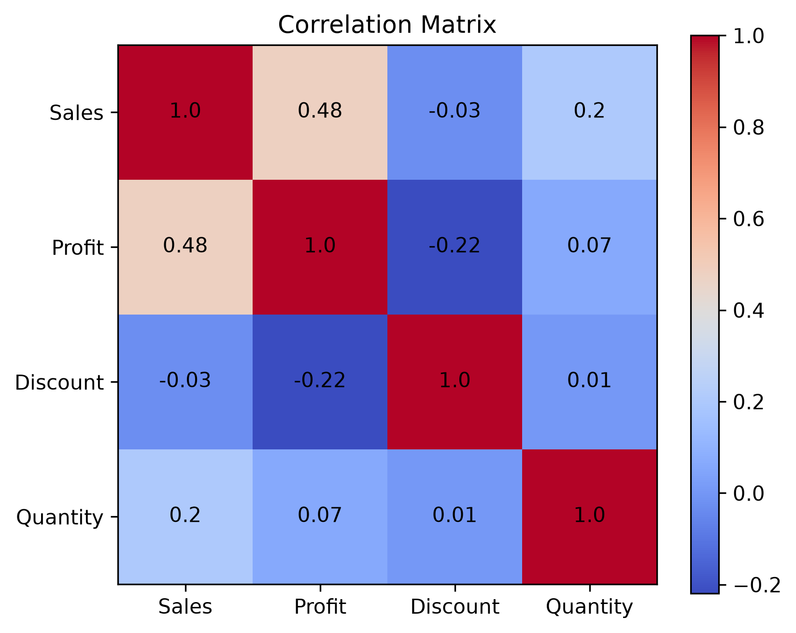

# 📊 Amazon Sales Analysis

A complete end-to-end Data Analysis project using **Python**, **Pandas**, **Matplotlib**, **PostgreSQL**, **Power BI**, **Git**, and **GitHub**. This project analyzes retail sales data to uncover business insights, identify sales trends, evaluate customer behavior, and support data-driven decision-making.

---

## 📌 Project Overview

The objective of this project is to perform Exploratory Data Analysis (EDA) on a retail sales dataset and extract meaningful business insights. The analysis focuses on sales performance, profitability, customer segments, shipping methods, product categories, regional performance, and monthly sales trends.

The project demonstrates the complete workflow of a Data Analyst, including:

- Data Cleaning
- Data Exploration
- Data Visualization
- Business Insights
- Business Recommendations

---

## 🎯 Business Problem

Retail companies generate thousands of sales transactions every day. Without proper analysis, it is difficult to understand:

- Which products generate the highest sales?
- Which regions contribute the most profit?
- Which customer segments are most valuable?
- How do discounts affect profitability?
- What are the monthly sales trends?
- Which shipping methods are most commonly used?

This project answers these questions using Python and data analysis techniques.

---

## 📂 Dataset Information

- **Dataset Name:** Superstore Sales Dataset
- **Source:** Kaggle
- **Records:** 9,994
- **Columns:** 21

The dataset contains information about:

- Orders
- Customers
- Products
- Sales
- Profit
- Quantity
- Discount
- Shipping
- Region
- State

---

## 🛠️ Tools & Technologies

| Tool | Purpose |
|-------|----------|
| Python | Data Analysis |
| Pandas | Data Manipulation |
| Matplotlib | Data Visualization |
| Jupyter Notebook | Analysis Environment |
| Git | Version Control |
| GitHub | Project Hosting |
| PostgreSQL | SQL Analysis *(Coming Soon)* |
| Power BI | Dashboard Creation *(Coming Soon)* |

---

## 📁 Project Structure

```text
amazon-sales-analysis/
│
├── data/
│   ├── Superstore.csv
│   └── Superstore_Cleaned.csv
│
├── notebooks/
│   └── Amazon_Sales_Analysis.ipynb
│
├── images/
│   ├── category_sales.png
│   ├── region_sales.png
│   ├── region_profit.png
│   ├── monthly_sales.png
│   ├── segment_sales.png
│   ├── segment_profit.png
│   ├── state_sales.png
│   ├── state_profit.png
│   ├── shipmode_sales.png
│   ├── shipmode_profit.png
│   ├── top_customers_sales.png
│   ├── top_customers_profit.png
│   └── correlation_matrix.png
│
├── sql/
│
├── dashboard/
│
├── README.md
├── requirements.txt
└── .gitignore
```

---

## 📈 Exploratory Data Analysis

The following analyses were performed:

### ✅ Data Cleaning

- Removed duplicate records
- Checked missing values
- Converted date columns to datetime format
- Extracted month information

### ✅ KPI Analysis

- Total Sales
- Total Profit
- Total Orders
- Average Sales
- Average Profit

### ✅ Sales Analysis

- Category-wise Sales
- Top Products by Sales
- Monthly Sales Trend
- State-wise Sales
- Region-wise Sales

### ✅ Profit Analysis

- Region-wise Profit
- State-wise Profit
- Segment-wise Profit
- Ship Mode Profit

### ✅ Customer Analysis

- Customer Segment Analysis
- Top 10 Customers
- Customer Profit Analysis

### ✅ Shipping Analysis

- Ship Mode Sales
- Ship Mode Profit

### ✅ Correlation Analysis

- Sales vs Profit
- Sales vs Quantity
- Discount vs Profit
- Correlation Heatmap

---

## 📊 Sample Visualizations

### Region-wise Profit



---

### Monthly Sales Trend



---

### Correlation Matrix



---

## 💡 Key Insights

- Consumer segment generated the highest sales.
- Standard Class was the most frequently used shipping method.
- California contributed the highest sales among all states.
- Sales and Profit showed a positive relationship.
- Higher discounts generally reduced profitability.
- Monthly sales varied significantly throughout the year.

---

## 📌 Business Recommendations

- Focus marketing efforts on high-performing customer segments.
- Review discount strategies to improve profitability.
- Increase investment in high-performing regions.
- Develop strategies to improve sales in underperforming states.
- Reward high-value customers with loyalty programs.

---

## 🚀 Future Improvements

- Build an interactive Power BI Dashboard.
- Perform advanced SQL analysis using PostgreSQL.
- Add forecasting using Machine Learning.
- Deploy the project as an interactive web application.

---

## ▶️ How to Run

1. Clone the repository

```bash
git clone https://github.com/YOUR_USERNAME/amazon-sales-analysis.git
```

2. Install required libraries

```bash
pip install -r requirements.txt
```

3. Open the Jupyter Notebook

```bash
Amazon_Sales_Analysis.ipynb
```

---

## 📚 Skills Demonstrated

- Data Cleaning
- Exploratory Data Analysis (EDA)
- Data Visualization
- Business Analysis
- Business Intelligence
- Statistical Analysis
- Git & GitHub
- Python Programming

---

## 👨‍💻 Author

**Veda Vardhan**

Aspiring Data Analyst passionate about solving business problems using data.

GitHub: https://github.com/Veda-Vardhan-07

---

## ⭐ If you found this project helpful, consider giving it a Star!
